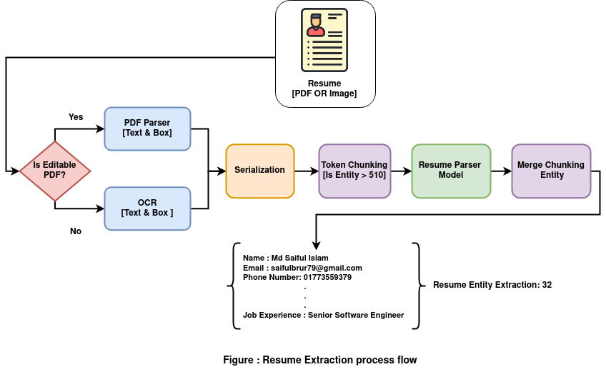

# Resume AI
Introducing Smart Resume AI: Revolutionizing Resume Sorting and Job Matching

Smart Resume AI is a cutting-edge LM BERT Based with an Extraction module. we have tried to solve problems using our approach till now not introducing the LLM model.
The resume AI module is the automated system to parses your resume and extracts it as structured format of the information



# 1. Setup Process [CPU]

Download Anaconda for Linux from [Here](https://www.anaconda.com/download#downloads)

## Install Anaconda [Linux or Mac]
Installation guideline here the link [Here](https://www.hostinger.com/tutorials/how-to-install-anaconda-on-ubuntu/)

## Environment Create

Run this command into the terminal,

```
conda create -n resume_ai python=3.8
```

### Active the Environment

```
conda activate resume_ai
```

### Install the Requirements

```
pip install -r requirements.txt
```

```
pip install PyMuPDF==1.18.15
```

__N.B: if torch and torchvision raise any version issue then set it below given this version__

```
torch==1.9.0
torchvision==0.10.0

```

## Model and Data Path Directory

Download the Model from this [link](https://drive.google.com/drive/folders/103Papg7ng83yqC7eApRoy2fs71jsebjX?usp=sharing)

put the model into this directory

```
resume_ai/resume_extractor/train_model/epoch=199-last.pt
```

And put the pdf Data link:
```
resume_ai/data
```


## Inference

Make sure the train ```model``` and ```input data folder``` path directory and run ```resume_controller.py```

```
python resume_controller.py
```

Check output into logs folder.


# 2. Colab

if you want to run this module into colab follow the below instruction

1. Upload the project folder into Google Drive
2. upload the ```resume_ai.ipynb``` file into colab
3. run all the code steps that have ````resume_ai.ipynb``` file.


# 3. Setup Process [GPU]
If you want to config your machine for gpu access please follow this blog: 
```
https://github.com/lab-semantics/Quick-Configuration/blob/master/configure-deep-learning-environment-for-gpu-machine.md
```

N.B: Video tutorial I will share as soon as possible.

# 4. Docker inference
__1. Install docker__

Ubuntu Docker install
 ```
 sudo apt-get install docker.io
 ```
 Mac
 please check the mac instructions i am unknown of this. please follow this link instructions.
 ```
 https://medium.com/crowdbotics/a-complete-one-by-one-guide-to-install-docker-on-your-mac-os-using-homebrew-e818eb4cfc3
 ```
 
__2. Build Docker file__ 
Open terminal inside ```Resume-AI``` folder
Build Docker
```
sudo docker build -t resume_ai:20230607 .
```
For building a docker image it takes some time. 
Check Docker images
```
sudo docker image
```
output
```
REPOSITORY           TAG       IMAGE ID       CREATED       SIZE
resume_ai            20230607  2581d97050d1   3 hours ago   4.18GB

```

__3. Run docker image__

```
sudo docker run -it 2581d97050d1 /bin/bash
```
or Mount the local path directory

```
sudo docker run -it -v /home/saiful/Desktop/Resume-AI-main:/home 2581d97050d1 /bin/bash
cd home
```
N.B : ```/home/saiful/Desktop/Resume-AI-main```Here this is your project path directory

Run,
```
python3 resume_controller.py
```
